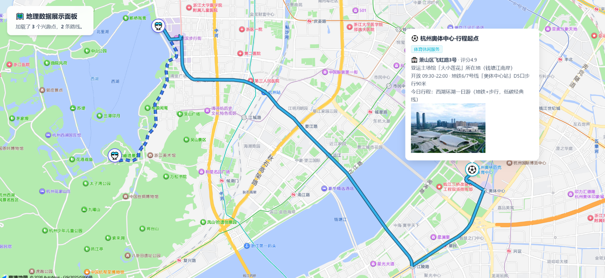
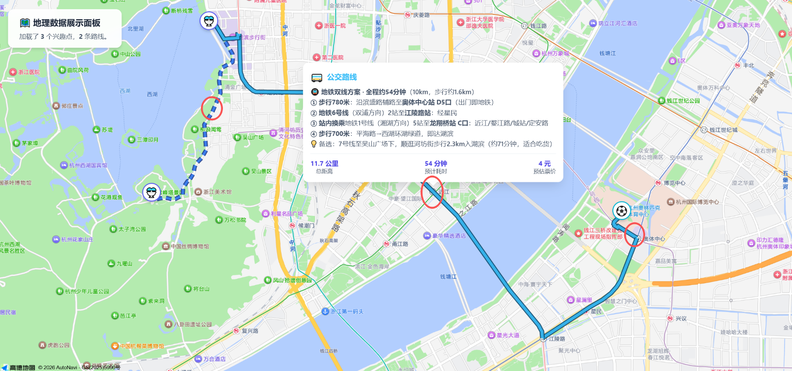

# 🗺️ amap-web-link-generate

本仓库是一个 **自制的高德地图展示Skill技能**，同时也是一份可独立运行的小工具：核心只有一个纯标准库的 Python 脚本。

**✨唯一功能** → 生成**高德官方**静态展示页的免key免登录地图分享链接，支持23类彩色图钉、驾车/步行/骑行/公交真实路线、弹窗富文本贴图。Use when user wants to 生成可分享地图链接、行程单、行程展示、路线展示页，或提到 高德地图链接、travel_plan、打点、路线可视化、静态地图、地图分享、带图行程单。数据采集可用 amap-maps MCP、高德 REST API 或任意地理编码手段。

> 生成的链接，复制发出去，对方双击打开就能看！链接来源自高德地图官方的静态地图展示页底座，安全可控。

## 🖼️ 效果预览

下面两张图来自同一条真实链接（杭州奥体中心 → 西湖，地铁 + 步行方案）：



**图 1**：左侧「地理数据展示面板」自动汇总本次行程（3 个兴趣点、2 条路线）；图钉点开是富文本弹窗——彩色分类标签、地址与评分、HTML 换行/加粗的开放时间与行程说明，还能直接贴高德官方实拍图。地图上是高德**实时规划**出的地铁线段（浅蓝实线）与步行接驳段（蓝色虚线），不是起终点直线。



**图 2**：点击路线折线，弹窗展示高德规划服务返回的完整公交方案——地铁 6 号线 → 换乘 1 号线 → 龙翔桥站出站步行入湖滨，含逐段步行米数、换乘指引、备选路线建议，底部是实算的 **11.7 公里 / 54 分钟 / 4 元**。距离、耗时、票价均由规划服务实时计算，不受你写在 remark 里的文字影响。

### 🔗 对应体验链接

点开即看，无需登录、无需申请任何 key：

**👉 [点击打开本例地图演示](https://a.amap.com/jsapi_demo_show/static/openclaw/travel_plan.html?data=%5B%7B%22type%22%3A%22poi%22%2C%22lnglat%22%3A%5B120.230349%2C30.228173%5D%2C%22sort%22%3A%22%E4%BD%93%E8%82%B2%E4%BC%91%E9%97%B2%E6%9C%8D%E5%8A%A1%22%2C%22text%22%3A%22%E6%9D%AD%E5%B7%9E%E5%A5%A5%E4%BD%93%E4%B8%AD%E5%BF%83%C2%B7%E8%A1%8C%E7%A8%8B%E8%B5%B7%E7%82%B9%22%2C%22remark%22%3A%22%F0%9F%8F%9F%EF%B8%8F%20%3Cb%3E%E8%90%A7%E5%B1%B1%E5%8C%BA%E9%A3%9E%E8%99%B9%E8%B7%AF3%E5%8F%B7%3C%2Fb%3E%20%C2%B7%20%E8%AF%84%E5%88%864.9%3Cbr%3E%E4%BA%9A%E8%BF%90%E4%B8%BB%E5%9C%BA%E9%A6%86%E3%80%8C%E5%A4%A7%E5%B0%8F%E8%8E%B2%E8%8A%B1%E3%80%8D%E6%89%80%E5%9C%A8%E5%9C%B0%EF%BC%88%E9%92%B1%E5%A1%98%E6%B1%9F%E5%8D%97%E5%B2%B8%EF%BC%89%3Cbr%3E%E5%BC%80%E6%94%BE%2009%3A30-22%3A00%20%C2%B7%20%E5%9C%B0%E9%93%816%2F7%E5%8F%B7%E7%BA%BF%E3%80%8C%E5%A5%A5%E4%BD%93%E4%B8%AD%E5%BF%83%E7%AB%99%E3%80%8DD5%E5%8F%A3%E6%AD%A5%E8%A1%8C90%E7%B1%B3%3Cbr%3E%E4%BB%8A%E6%97%A5%E8%A1%8C%E7%A8%8B%EF%BC%9A%E8%A5%BF%E6%B9%96%E7%8E%AF%E6%B9%96%E4%B8%80%E6%97%A5%E6%B8%B8%EF%BC%88%E5%9C%B0%E9%93%81%2B%E6%AD%A5%E8%A1%8C%EF%BC%8C%E4%BD%8E%E7%A2%B3%E7%BB%8F%E5%85%B8%E7%BA%BF%EF%BC%89%3Cbr%3E%3Cimg%20src%3D%27https%3A%2F%2Fstore.is.autonavi.com%2Fshowpic%2F0614e66228a1da42c63b174e85c2b700%27%20width%3D%27210%27%3E%22%7D%2C%7B%22type%22%3A%22route%22%2C%22routeType%22%3A%22transfer%22%2C%22city%22%3A%22%E6%9D%AD%E5%B7%9E%22%2C%22start%22%3A%5B120.230349%2C30.228173%5D%2C%22end%22%3A%5B120.158818%2C30.256583%5D%2C%22remark%22%3A%22%F0%9F%9A%87%20%3Cb%3E%E5%9C%B0%E9%93%81%E5%8F%8C%E7%BA%BF%E6%96%B9%E6%A1%88%20%C2%B7%20%E5%85%A8%E7%A8%8B%E7%BA%A654%E5%88%86%E9%92%9F%3C%2Fb%3E%EF%BC%8810km%EF%BC%8C%E6%AD%A5%E8%A1%8C%E7%BA%A61.6km%EF%BC%89%3Cbr%3E%3Cb%3E%E2%91%A0%20%E6%AD%A5%E8%A1%8C780%E7%B1%B3%3C%2Fb%3E%EF%BC%9A%E6%B2%BF%E6%BB%A8%E7%9B%9B%E8%B7%AF%E8%BE%85%E8%B7%AF%E8%87%B3%3Cb%3E%E5%A5%A5%E4%BD%93%E4%B8%AD%E5%BF%83%E7%AB%99%20D5%E5%8F%A3%3C%2Fb%3E%EF%BC%88%E5%87%BA%E9%97%A8%E5%8D%B3%E5%9C%B0%E9%93%81%EF%BC%89%3Cbr%3E%3Cb%3E%E2%91%A1%20%E5%9C%B0%E9%93%816%E5%8F%B7%E7%BA%BF%3C%2Fb%3E%EF%BC%88%E5%8F%8C%E6%B5%A6%E6%96%B9%E5%90%91%EF%BC%892%E7%AB%99%E8%87%B3%3Cb%3E%E6%B1%9F%E9%99%B5%E8%B7%AF%E7%AB%99%3C%2Fb%3E%EF%BC%9A%E7%BB%8F%E6%98%9F%E6%B0%91%3Cbr%3E%3Cb%3E%E2%91%A2%20%E7%AB%99%E5%86%85%E6%8D%A2%E4%B9%98%3C%2Fb%3E%E5%9C%B0%E9%93%811%E5%8F%B7%E7%BA%BF%EF%BC%88%E6%B9%98%E6%B9%96%E6%96%B9%E5%90%91%EF%BC%895%E7%AB%99%E8%87%B3%3Cb%3E%E9%BE%99%E7%BF%94%E6%A1%A5%E7%AB%99%20C%E5%8F%A3%3C%2Fb%3E%EF%BC%9A%E8%BF%91%E6%B1%9F%2F%E5%A9%BA%E6%B1%9F%E8%B7%AF%2F%E5%9F%8E%E7%AB%99%2F%E5%AE%9A%E5%AE%89%E8%B7%AF%3Cbr%3E%3Cb%3E%E2%91%A3%20%E6%AD%A5%E8%A1%8C700%E7%B1%B3%3C%2Fb%3E%EF%BC%9A%E5%B9%B3%E6%B5%B7%E8%B7%AF%E2%86%92%E8%A5%BF%E6%B9%96%E7%8E%AF%E6%B9%96%E7%BB%BF%E9%81%93%EF%BC%8C%E5%8D%B3%E8%BE%BE%E6%B9%96%E6%BB%A8%3Cbr%3E%F0%9F%92%A1%20%E5%A4%87%E9%80%89%EF%BC%9A7%E5%8F%B7%E7%BA%BF%E8%87%B3%E5%90%B4%E5%B1%B1%E5%B9%BF%E5%9C%BA%E4%B8%8B%EF%BC%8C%E9%A1%BA%E9%80%9B%E6%B2%B3%E5%9D%8A%E8%A1%97%E6%AD%A5%E8%A1%8C2.3km%E5%85%A5%E6%B9%96%E6%BB%A8%EF%BC%88%E7%BA%A671%E5%88%86%E9%92%9F%EF%BC%8C%E9%80%82%E5%90%88%E5%90%83%E8%B4%A7%EF%BC%89%22%7D%2C%7B%22type%22%3A%22poi%22%2C%22lnglat%22%3A%5B120.158818%2C30.256583%5D%2C%22sort%22%3A%22%E9%A3%8E%E6%99%AF%E5%90%8D%E8%83%9C%22%2C%22text%22%3A%22%E8%A5%BF%E6%B9%96%C2%B7%E6%B9%96%E6%BB%A8%EF%BC%88%E6%B9%96%E6%BB%A8%E6%99%B4%E9%9B%A8%EF%BC%89%22%2C%22remark%22%3A%22%F0%9F%8F%9E%EF%B8%8F%20%3Cb%3E%E8%A5%BF%E6%B9%96%E4%B8%9C%E5%B2%B8%E7%BB%8F%E5%85%B8%E5%85%A5%E5%8F%A3%3C%2Fb%3E%20%C2%B7%205A%E6%99%AF%E5%8C%BA%20%C2%B7%20%E8%AF%84%E5%88%864.9%3Cbr%3E%E6%B9%96%E6%BB%A8%E4%B8%80%E5%85%AC%E5%9B%AD%EF%BC%8C%E8%A5%BF%E6%B9%96%E5%8D%81%E6%99%AF%E3%80%8C%E6%B9%96%E6%BB%A8%E6%99%B4%E9%9B%A8%E3%80%8D%E6%89%80%E5%9C%A8%E5%9C%B0%3Cbr%3E%E5%85%A8%E5%A4%A9%E5%BC%80%E6%94%BE%20%C2%B7%20%E5%85%8D%E8%B4%B9%3Cbr%3E%E5%BB%BA%E8%AE%AE%EF%BC%9A%E6%B2%BF%E6%B9%96%E5%BE%80%E5%8D%97%E6%BC%AB%E6%AD%A5%EF%BC%8C%E5%BC%80%E5%90%AF%E8%A5%BF%E6%B9%96%E5%8D%97%E7%BA%BF%E4%B9%8B%E6%97%85%3Cbr%3E%3Cimg%20src%3D%27https%3A%2F%2Fstore.is.autonavi.com%2Fshowpic%2F04A76AB46308410FBDAF3C8577E67275%27%20width%3D%27210%27%3E%22%7D%2C%7B%22type%22%3A%22route%22%2C%22routeType%22%3A%22walking%22%2C%22start%22%3A%5B120.158818%2C30.256583%5D%2C%22end%22%3A%5B120.148849%2C30.230934%5D%2C%22remark%22%3A%22%F0%9F%9A%B6%20%3Cb%3E%E8%A5%BF%E6%B9%96%E5%8D%97%E7%BA%BF%E6%B9%96%E7%95%94%E6%BC%AB%E6%AD%A5%20%C2%B7%20%E7%BA%A64.3km%20%2F%2057%E5%88%86%E9%92%9F%3C%2Fb%3E%3Cbr%3E%E5%85%A8%E7%A8%8B%E6%B2%BF%3Cb%3E%E8%A5%BF%E6%B9%96%E7%8E%AF%E6%B9%96%E7%BB%BF%E9%81%93%3C%2Fb%3E%EF%BC%9A%E6%B9%96%E6%BB%A8%20%E2%86%92%20%E6%9F%B3%E6%B5%AA%E9%97%BB%E8%8E%BA%20%E2%86%92%20%E9%95%BF%E6%A1%A5%E5%85%AC%E5%9B%AD%20%E2%86%92%20%E9%9B%B7%E5%B3%B0%E5%A4%95%E7%85%A7%3Cbr%3E%E4%B8%80%E8%B7%AF%E6%B9%96%E5%85%89%E5%B1%B1%E8%89%B2%EF%BC%8C%E6%9D%AD%E5%B7%9E%E6%9C%80%E7%BB%8F%E5%85%B8%E7%9A%84CityWalk%E8%B7%AF%E6%AE%B5%3Cbr%3E%F0%9F%92%A1%20%E7%9C%81%E5%8A%9B%E6%9B%BF%E4%BB%A3%EF%BC%9A%E8%A5%BF%E6%B9%96%E8%A7%82%E5%85%89%E7%94%B5%E7%93%B6%E8%BD%A6%EF%BC%88%E7%8E%AF%E6%B9%96%E6%8B%9B%E6%89%8B%E5%8D%B3%E5%81%9C%EF%BC%8C%E7%BA%A610%E5%85%83%2F%E5%8C%BA%E6%AE%B5%EF%BC%89%22%7D%2C%7B%22type%22%3A%22poi%22%2C%22lnglat%22%3A%5B120.148849%2C30.230934%5D%2C%22sort%22%3A%22%E9%A3%8E%E6%99%AF%E5%90%8D%E8%83%9C%22%2C%22text%22%3A%22%E9%9B%B7%E5%B3%B0%E5%A1%94%E6%99%AF%E5%8C%BA%C2%B7%E8%A1%8C%E7%A8%8B%E7%BB%88%E7%82%B9%22%2C%22remark%22%3A%22%F0%9F%97%BC%20%3Cb%3E%E5%8D%97%E5%B1%B1%E8%B7%AF15%E5%8F%B7%3C%2Fb%3E%20%C2%B7%204A%E6%99%AF%E5%8C%BA%20%C2%B7%20%E8%AF%84%E5%88%864.8%3Cbr%3E10%E6%9C%88%E5%BC%80%E6%94%BE%20%3Cb%3E08%3A00-20%3A00%3C%2Fb%3E%EF%BC%88%E6%9C%80%E6%99%9A%E5%85%A5%E5%9B%AD19%3A30%EF%BC%89%3Cbr%3E%E7%99%BB%E5%A1%94%E5%8F%AF%E4%BF%AF%E7%9E%B0%E8%A5%BF%E6%B9%96%E5%85%A8%E6%99%AF%EF%BC%8C%E3%80%8C%E9%9B%B7%E5%B3%B0%E5%A4%95%E7%85%A7%E3%80%8D%E4%B8%BA%E8%A5%BF%E6%B9%96%E5%8D%81%E6%99%AF%E4%B9%8B%E4%B8%80%3Cbr%3E%E5%A4%95%E9%98%B3%E6%97%B6%E5%88%86%E7%99%BB%E5%A1%94%E6%9C%80%E4%BD%B3%EF%BC%8C%E5%9B%9E%E7%A8%8B%E5%8F%AF%E4%BB%8E%E9%9B%B7%E5%B3%B0%E5%A1%94%E7%AB%99%E4%B9%89%E8%A7%82%E5%85%89%E5%B7%B4%E5%A3%AB%E8%BF%94%E6%BB%A8%E6%B1%9F%3Cbr%3E%3Cimg%20src%3D%27https%3A%2F%2Fstore.is.autonavi.com%2Fshowpic%2F58fbc3bf5460862ef2056ae1aa053754%27%20width%3D%27210%27%3E%22%7D%5D)**

## 💡 原理

链接指向的是**高德官方公开的静态演示页**（约 22KB 纯 HTML），收到 `data` 参数后由页面**实时调用高德路径规划服务**（`AMap.Driving / Walking / Riding / Transfer`）绘制真实道路与公交几何。

地图渲染用的 JSAPI key 内置于该页面、且绑定 `a.amap.com` 域名白名单，因此：

- ✅ 生成链接与打开链接**全程零 key、零登录、零依赖**
- ✅ 路线是规划服务算出来的真几何，不是起终点连线
- ✅ 页面归高德所有，渲染逻辑稳定，无需自行部署

注：数据怎么来是调用方你自己的事（见下方 Step 1 的三条路径），与本工具无关！一般建议你先使用高德MCP先行采集数据，再用本工具生成链接（即本Skill技能默认可与高德MCP完美配合）。

## ✨ 特性

| 能力 | 说明 |
|---|---|
| 23 类彩色图钉 | `sort` 写高德标准类目名即自动命中对应图标与配色，写自定义词落回默认 📌 |
| 四种线型语义 | 驾车（绿实线 + 白色方向箭头流）/ 步行（蓝虚线）/ 骑行（橙虚线）/ 公交地铁（浅蓝实线 + 步行接驳虚线） |
| 真实路线规划 | 由高德规划服务实时计算，弹窗显示实算距离、耗时、票价、过路费 |
| 富文本弹窗 | `remark` 支持 HTML：`<br>` 换行、`<b>` 加粗、`` 贴图（推荐高德官方图床） |
| 两条起终点写法 | `[经度,纬度]` 坐标，或 `{"keyword":"地名","city":"城市"}` 交给页面自动地理编码 |
| 多点顺路游 | `waypoints` 一线串起 ≤16 个途经点 |
| 交付三查 | 脚本自动校验 HTTP 200 / 落点仍是 `a.amap.com` / 标题匹配 / 无登录墙，不过不交付 |
| 零第三方依赖 | 仅用 Python 标准库（`urllib` + 手动 gzip/deflate 解压），无需 pip install |

## 📦 安装

仓库结构遵循 Skill 规范，技能目录为 `skills/amap-web-link-generate/`。

**方式一：安装为 你Agent的skill技能（推荐）**

把技能目录复制到 你Agent 的用户级技能目录skills/里即可，之后用自然语言描述需求就会自动触发：

```bash
git clone https://github.com/HnBigVolibear/amap-web-link-generate-skill.git

# 这里以 CN 版 Trae 为例 → ~/.trae-cn/skills/
cp -r amap-web-link-generate-skill/skills/amap-web-link-generate ~/.trae-cn/skills/

```

**方式二：只用脚本**

不需要任何安装，有 Python3 就能跑：

```bash
python skills/amap-web-link-generate/scripts/build_link.py data.json
```

## 🚀 快速开始（4 步）

### 📡 Step 1 — 采集真实数据

| 路径 | 适用 | 手段 |
|---|---|---|
| A. amap-maps MCP | 本机已挂载该 MCP 时首选！ | `maps_text_search` 找 POI → `maps_search_detail` 拿精确坐标 / 评分 / 开放时间 / **官方实拍图 URL**；公交 `maps_direction_transit_integrated`（必须传 city） |
| B. 高德 Web 服务 REST API | 其他 agent / 脚本 | `/v3/geocode/geo`、`/v3/place/text`、`/v3/direction/transit/integrated`，需自备 Web Service key |
| C. 任意地理编码手段 | 兜底 | 只要能得到「经度,纬度」即可；也可直接跳过坐标，用 Step 2 的 keyword 格式 |

⚠️ 高德接口请**串行调用、每次间隔 ≥1 秒**，并发会撞 `CUQPS_HAS_EXCEEDED_THE_LIMIT`（个人开发者并发配额为 1）。

- 原则上，本Skill建议**首选高德MCP**方式来采集数据，因为高德MCP提供了更详细的数据（如评分、开放时间、官方实拍图 URL。尤其是直接可以查询到你目标地点的相关配图，可以直接用于本Skill生成链接页面里的配图展示！让最终效果更加活灵活现！）

### 🧱 Step 2 — 构造 data JSON 数组

POI 与 route 混排进同一个数组，**顺序即叙事顺序**（第 1 站 → 路线 → 第 2 站 → 路线 → …）：

```json
[
  {"type": "poi", "lnglat": [116.397029, 39.917839], "sort": "风景名胜", "text": "故宫博物院",
   "remark": "5A级景区·世界文化遗产，评分4.9<br><b>旺季 08:30-17:00（周一闭馆）</b>"},
  {"type": "route", "routeType": "transfer", "city": "北京",
   "start": [116.397029, 39.917839], "end": [116.275179, 39.999617],
   "remark": "第①程：步行约800米至神武门站→101/103路3站至西四路口东→地铁4号线13站至北宫门站"}
]
```

### 🛠️ Step 3 — 运行脚本生成链接

```bash
python "<base_dir>/scripts/build_link.py" <data.json>                  # 生成 + 三查验证
python "<base_dir>/scripts/build_link.py" <data.json> --out link.txt   # 另存链接到文件
python "<base_dir>/scripts/build_link.py" <data.json> --no-check       # 跳过网络验证
python "<base_dir>/scripts/build_link.py" <data.json> --http           # 页面用 http 协议（见坑 #2）
```

脚本一步到位：编码拼接 → 结构预检（transfer 缺 city / routeType 非法 / 坐标格式错都会报警）→ **交付三查**。

### 🎯 Step 4 — 交付

链接放**代码框**里发出（长链接经 markdown 渲染易截断），提醒对方双击全选复制、别漏尾部 `%5D`。

三查通过即视为交付成功，**无需再打开链接做渲染验证**——页面渲染由高德官方保证。

## 📐 data 接口契约

### 📍 POI 项

| 字段 | 必填 | 说明 |
|---|---|---|
| `type` | — | `poi`（缺省时页面也按 poi 处理） |
| `lnglat` | ✅ | `[经度, 纬度]`，注意经度在前 |
| `sort` | 建议 | **必须是 23 类标准类目名**，决定图钉图标与颜色 |
| `text` | ✅ | 名称（弹窗标题） |
| `remark` | 建议 | 描述文字，支持 HTML；贴图用 ``（属性用单引号，限宽 210 防撑破弹窗） |

### 🛣️ route 项

| 字段 | 必填 | 说明 |
|---|---|---|
| `routeType` | ✅ | `driving` / `walking` / `riding` / `transfer` |
| `start` / `end` | ✅ | `[lng,lat]` 坐标，或 `{"keyword":"地名","city":"城市"}` 关键字对象 |
| `city` | transfer 必带 | 公交规划城市，**缺省时页面默认「北京」，跨城必须显式传** |
| `remark` | 建议 | 方案说明文字；弹窗另会显示规划服务实算的距离/耗时 |
| `policy` | 可选 | 驾车 / 骑行策略（默认 0） |
| `nightflag` | 可选 | 公交夜班车（true / false） |
| `waypoints` | 可选 | 驾车途经点数组（≤16 个 `[lng,lat]`） |

## 📌 POI 分类图钉（23 类）

| 类目 | 图钉 | 类目 | 图钉 |
|---|---|---|---|
| 餐饮服务 | 🍑 汉堡 · 绿 | 购物服务 | 🛍️ · 青绿 |
| 生活服务 | 💇 · 青 | 体育休闲服务 | ⚽ · 青 |
| 医疗保健服务 | 🏥 · 天蓝 | 住宿服务 | 🛏️ · 蓝 |
| 风景名胜 | ⛲ · 靛蓝 | 商务住宅 | 🏢 · 紫 |
| 科教文化服务 | 🏫 · 品红 | 交通设施服务 | 🚌 · 粉 |
| 金融保险服务 | 💵 · 玫红 | 公司企业 | 💼 · 灰 |
| 政府机构及社会团体 | 🏛️ · 亮紫 | 汽车服务 | 🚗 · 红 |
| 汽车销售 | 🚘 · 橙 | 汽车维修 | 🔧 · 黄 |
| 摩托车服务 | 🏍️ · 黄绿 | 道路附属设施 | 🛣️ · 灰 |
| 地名地址信息 | 📍 · 灰 | 公共设施 | 🚾 · 暖灰 |
| 事件活动 | 🎪 · 红 | 室内设施 | 🚪 · 橙 |
| 通行设施 | 🚧 · 暗黄 | 未命中 | 📌 · 靛蓝（默认） |

🎁 **批量自动化技巧**：这 23 类与高德 POI 接口返回的 `type` 字段（形如 `餐饮服务;中餐厅;中餐厅`）**第一段完全对齐**，因此 `sort = type.split(';')[0]` 即可全自动命中彩色图钉，无需人工挑类目。

## 📂 示例文件

`skills/amap-web-link-generate/examples/` 下五个实测样例，覆盖全部玩法谱系：

| 示例 | 演示玩法 |
|---|---|
| `lunch_circle_poi_only.json` | **基础打点**：纯 POI + 标准类目彩色图钉 + HTML 富文本，自动适配视野 |
| `beijing_day_trip.json` | **多段换乘**：3 景点 + 2 段 transfer 公交/地铁方案，弹窗带实算距离耗时 |
| `beijing_richtext_multimodal.json` | **完全体**：三类图钉 + remark 贴高德图床实拍图 + 公交与打车混合（绿箭头线与浅蓝线分层同图） |
| `route_styles_four_types.json` | **四线型环线**：一条链接里四种线型同图 + keyword 起终点写法（免查坐标） |
| `waypoints_scenic_drive.json` | **驾车顺路游**：单条 driving + waypoints 一线串 3 点 |

## 🎨 打点配图策略

1. **默认尝试带图，但图源仅限高德官方 POI 自带图**——`maps_search_detail` 返回的 `photo` 字段（官方图床，公开可访问、无防盗链）
2. **官方无图则不配图**，弹窗保持纯文字净版（图钉、名称、分类标签、描述俱全，完整可用），这是正常现象，不是故障
3. 仅当用户明确要求「无官方图的打点也要带图」时，才先询问用户选择途径（Agent 绘图 / 联网搜图），征得同意后再补，且图片落地为公网 URL 后须实测匿名 HTTP 200 且 Content-Type 为图片

## ⚠️ 红线与坑

1. **transfer 缺 `city` 会默认「北京」**，跨城必须显式传
2. **图片协议要匹配**：https 图片（含外部图床 https 直链）→ 页面保持 https；**http-only 图片 → 须把页面链接改成 `http://a.amap.com/jsapi_demo_show/...`**，否则 https 页面下会被浏览器拦截（实测高德服务器双协议直接服役、不强制跳转）
3. **高德接口串行调用**，并发撞 QPS 限流
4. **`sort` 必须用标准类目名**，自定义词等于放弃彩色图钉
5. **无 `data` 参数时**页面会展示内置的北京演示数据（故宫/三里屯/北大），别误判成自己数据没渲染出来
6. **链接长度建议控制在十 KB 内**，超长行程拆多条链接
7. **区分「页面实算」与「remark 文字」**：弹窗里的距离/耗时/费用是规划服务实算值，remark 只是方案说明
8. **两处固定文案不可自定义**：标签页标题「兴趣点与路线规划展示」与面板标题「地理数据展示面板」由页面写死

## 🗂️ 项目结构

```
amap-web-link-generate-skill/
├── skills/
│   └── amap-web-link-generate/
│       ├── SKILL.md              # 技能说明与完整工作流
│       ├── scripts/
│       │   └── build_link.py     # 核心脚本：编码 + 结构预检 + 交付三查
│       └── examples/             # 五个实测样例 JSON
├── Images/                       # 相关配图
└── LICENSE
```

---

## 📄 免责声明

本项目仅生成指向高德官方公开演示页的链接，地图数据与路线规划服务均来自高德地图。使用时请遵守高德开放平台的相关服务条款；POI 数据请通过合规途径获取。

## 📜 License

[MIT](LICENSE) © 2026 湖南大白熊工作室

---

**⭐ 如果这个项目对你有帮助，请给一个 Star！**

*Made with ❤️ by 湖南大白熊*

#### Buy me a Coffee:

